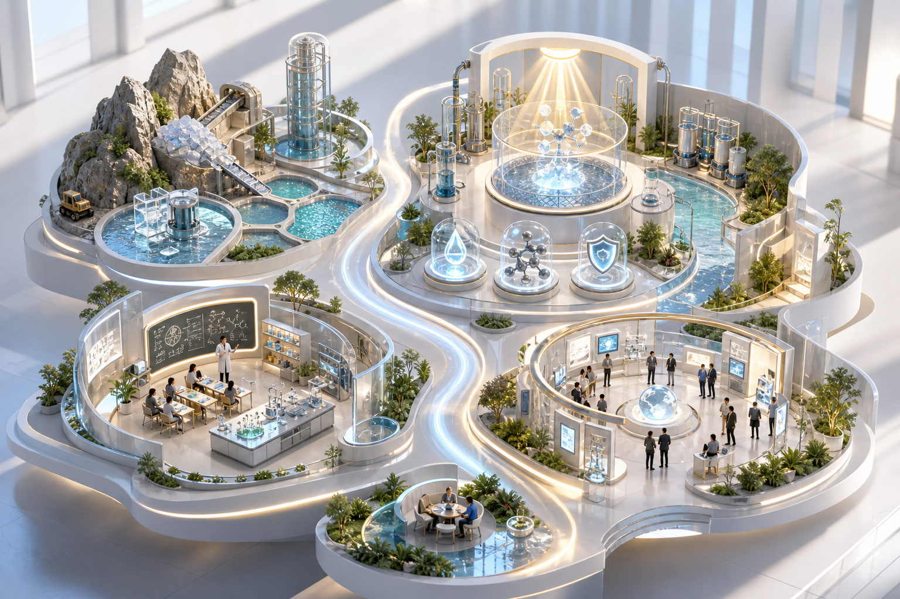

# 从资源到生活

一个以 3D 可持续世界为入口的个人作品集。

[](https://cynthia5810.github.io/personal-web/)

**在线访问：** [https://cynthia5810.github.io/personal-web/](https://cynthia5810.github.io/personal-web/)



## 项目概念

网站没有采用传统简历的信息流作为开场，而是把个人经历放入一个相互连接的可持续系统：

`关键资源 → 绿色分离 → 光与碳转化 → 环境健康 → 知识培养 → 交流连接`

首页的 3D 图谱包含六个主题：

| 主题 | 代表内容 |
| --- | --- |
| 关键资源 | 锂辉石提锂、盐湖分离、新能源上游资源 |
| 水系统 | 水净化、绿色分离、水环境 |
| 碳与光 | 光催化、二氧化碳还原、低碳转化 |
| 环境健康 | 光催化抗菌、环境修复、健康空间 |
| 知识培养 | 化学教学、科研训练、人才培养 |
| 交流连接 | 展览组织、跨领域协作、知识传播 |

## 页面

- **系统图谱**：以可交互的 3D 世界建立个人叙事
- **个人主页**：介绍研究背景、跨领域探索与核心能力
- **项目作品**：呈现科研、行业调研、AI 产品和创客实践
- **成长时间线**：梳理学习、研究与实践经历
- **世界地图**：连接不同城市中的项目经验

## 本地运行

```bash
npm install
npm run dev
```

生产构建：

```bash
npm run build
```

## 技术栈

React · Vite · React Router · Tailwind CSS · Lucide React · GitHub Pages

## 主要文件

```text
src/pages/Home.jsx          3D 系统图谱开场页
src/pages/Portfolio.jsx     完整个人主页
src/pages/Projects.jsx      项目列表与详情
src/pages/Timeline.jsx      成长时间线
src/data/                   项目与经历数据
public/sustainable-world.png
```

推送到 `main` 分支后，GitHub Actions 会自动构建并发布网站。
